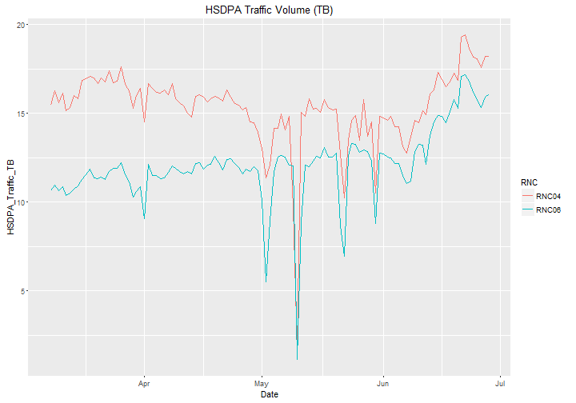

## Old School Visualization

--- .class #id 

## Next Generation Visualization: Motion Charts

<iframe src="./assets/widgets/temp.html" width=100% height=125% allowtransparency="true"> </iframe>

--- .class #id 

## Line Chart : Next Level

<iframe src="./assets/widgets/temp1.html" width=100% height=125% allowtransparency="true"> </iframe>

--- .segue bg:grey # Set Background as Grey

# Thank You
